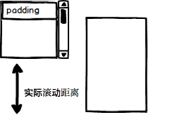

# offset, client, scroll 三类 api 的区别

## offset 定义偏移量,与目标元素的距离

`offsetTop`, `offsetLeft`, `offsetWidth`, `offsetHeight`, `offsetParent`

top/left: 描述元素相对于其 offsetParent 元素的 padding-box 的距离
width/height: 描述元素的 border-box 尺寸
offsetParent: 包含该元素的 -- 最近定位元素(包括`relative`), 或者 table 元素,或者根元素

## scroll 定义滚动距离

`scrollHeight`, `scrollWidth`, `scrollLeft`, `scrollTop`
top/left: 描述元素的滚动距离(滚动条移动的距离).
width/height: 描述元素内部的实际空间大小(不包括滚动条, 包含 padding), 以 scrollHeight 为例:
 + 若有滚动条, scrollHeight = 该元素视口 + 最大滚动距离(或者说该元素 padding * 2 + 子元素高度);
 + 若无滚动条, scrollHeight = 该元素视口

### 如何计算最大滚动距离?

如果该元素`box-sizing`是`content-box`, 那么增加该元素的 padding, 是 **不影响** 最大滚动距离的!, 见图:

# client 定义元素自身的尺寸

`clientLeft`, `clientTop`, `clientHeight`, `clientWidth`

left/top: 描述元素边框的尺寸(左边框/上边框)
width/height: 描述元素视口的尺寸(不包括滚动条,包含 padding)

> 上面三类 api 都会对小数四舍五入取整, 返回整数