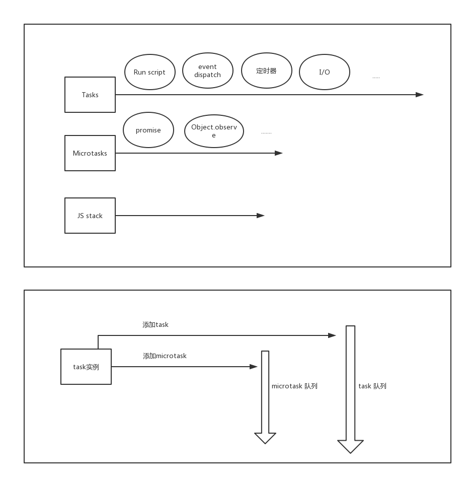

# event loop

## 关键字

1. tasks
2. microtask(job) 队列
3. js Stack (执行栈)

## 执行顺序

1. 当前`task` 执行完毕 -> 清空`microtask`队列 -> 下一个`task` (新的循环开始)
2. 如果当前的`js stack`为空,则直接清空`microtask`队列,然后继续执行当前`task`完毕 -> 清空`microtask`队列(如果需要) -> 下一个`task` (新循环开始)

> 每个`task source`(用户交互,定时器....)都有自己的task队列(队列内task顺序确定,先进先出), 不同的`task source`之间有优先级差异(因浏览器而异),比如说用户交互有高优先级,可能会优先于定时器执行
> 
> 关于定时器: 主线程执行时遇到定时器,交给其他线程后继续执行, 特定线程等待相应时间后创建task, 主线程选择时机执行该task

## 理解图

## 一些思考

1. 本质上类似任务调度系统,目的是尽可能的提高 js 执行引擎的效率

## 其他

不同浏览器的具体效果不一致.

## 参考

1. [Tasks, microtasks, queues and schedules](https://jakearchibald.com/2015/tasks-microtasks-queues-and-schedules/)
2. [great talk at JSConf on the event loop](https://www.youtube.com/watch?v=8aGhZQkoFbQ)